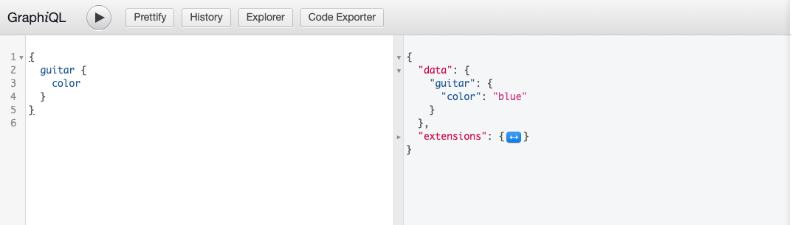

# WPGraphQL Blue Guitar

Demo plugin, created as a joke, to show how to query a blue guitar using WPGraphQL.

```graphql
query {
  guitar {
    color
  }
}
```

will return:

```json
{
  "data": {
    "guitar": {
      "color": "blue"
    }
  }
}
```

## In Action


